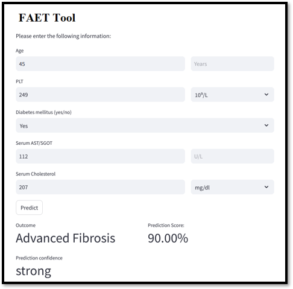

# 🧠 FAET Tool – AI-Based Advanced Fibrosis Prediction

## 🚀 Overview

FAET (Fibrosis Assessment using Extra Trees) is a web-based AI application developed to predict advanced liver fibrosis using minimal clinical inputs. The tool is designed for quick, real-time risk assessment and aims to assist early screening in healthcare settings.

## 🎯 Objective

* Predict advanced fibrosis (Advanced vs Non-Advanced)
* Provide a simple, low-cost, and scalable AI solution
* Improve over traditional clinical scoring systems (FIB-4, APRI)

## 🖥️ Application Interface

The application is built using Streamlit and provides a user-friendly interface where users input five clinical parameters:

* Age
* Platelet Count (PLT)
* Diabetes Status
* Serum AST/SGOT
* Serum Cholesterol

The system processes inputs and returns:

* Predicted Class (Advanced / Non-Advanced Fibrosis)
* Prediction Score (Probability)
* Confidence Level

## 📸 Screenshot

## ⚙️ Methodology

* Data preprocessing and cleaning
* Feature selection (reduced to 5 key clinical parameters)
* Model used:

  * Extra Trees Classifier
* Model evaluation using cross-validation

## 📈 Results

### 🔹 5-Feature Model (Deployed in App)

* Accuracy: 82%
* AUC: 0.80
* F1 Score: 0.76
* NPV: 0.83
* PPV: 0.79

### 🔹 13-Feature Model (Best Performance)

* Achieved higher PPV and overall performance compared to reduced model

### ⚖️ Design Decision

Although the 13-feature model provided slightly better performance, the 5-feature model was selected for deployment due to:

* Comparable performance across most evaluation metrics
* Significant reduction in input complexity
* Improved usability in real-world clinical settings

This trade-off enables a **scalable, cost-effective, and user-friendly AI solution** without substantial loss in predictive performance.

## 🔬 Key Contributions

* Developed a **data-efficient ML model** using only 5 input features
* Achieved high predictive performance compared to traditional clinical indices
* Built a **deployable AI web application** for real-time inference
* Designed for **accessibility in low-resource clinical environments**

## 🛠️ Tech Stack

* Python
* Streamlit
* scikit-learn

## 📌 Future Work

* Integration with electronic health records (EHR)
* Deployment on cloud platforms
* Extension using Quantum Machine Learning and Graph-based methods

## 👩‍💻 Author

Shobha Sharma
